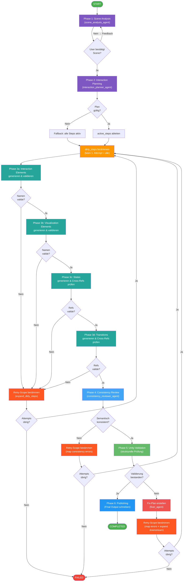

# Vivian LLM SpecGen – Pipeline Workflow (Miro-optimiert)

Dieses vereinfachte Diagramm ist für den Import in **Miro** optimiert:
- Keine verschachtelten Subgraphs
- Klare lineare Struktur mit deutlichen Retry-Pfaden
- Kurze Labels für bessere Lesbarkeit

**Import in Miro:** `/` drücken → "Mermaid" → Code einfügen.



## Farbkodierung

| Farbe | Bedeutung |
|-------|-----------|
| 🟣 Lila | Analyse & Planung |
| 🟢 Türkis | Spec-Generierung (Phase 3a–3d) |
| 🔵 Blau | Review & Validierung |
| 🟠 Orange | Dirty-Steps-Bestimmung (Retry-Einstieg) |
| 🔴 Rot | Fehler-Handling & Retry-Scope |
| 🟢 Grün | Start / Erfolg |

## Retry-Loops im Überblick

Das Diagramm zeigt **3 Retry-Einstiegspunkte**, die alle zum selben Punkt zurückführen:

```
                    ┌─────────────────────────────────────────────┐
                    │                                             │
  ┌── Retry 1: ElementNameMismatchError (Phase 3) ──┐           │
  ├── Retry 2: Consistency-Fehler (Phase 4) ─────────┼──→ dirty_steps ──→ Phase 3
  └── Retry 3: Validation-Fehler (Phase 5+6) ───────┘           │
                    │                                             │
                    └──── max_attempts erschöpft? ──→ FAILED ────┘
```

## Hinweis: Steps überspringen

In der vereinfachten Darstellung nicht explizit gezeigt:
Jeder Generierungs-Step (3a–3d) wird **nur ausgeführt wenn er `dirty` UND `active` ist**.
Nicht betroffene Steps werden übersprungen – das ist der Kern der effizienten Retry-Strategie.
