# Vivian LLM SpecGen – Pipeline Workflow (Miro-optimiert)

Dieses vereinfachte Diagramm ist für den Import in **Miro** optimiert:
- Keine verschachtelten Subgraphs
- Klare lineare Struktur mit deutlichen Retry-Pfaden
- Kurze Labels für bessere Lesbarkeit

**Import in Miro:** `/` drücken → "Mermaid" → Code einfügen.

```mermaid
flowchart TD
    START([START]) --> SCENE["Phase 1a: Scene Analysis\n(scene_analysis_agent)"]

    SCENE --> PLAN_INIT["Phase 1b: Interaction Planning\n(interaction_planner_agent)\nErstellt InteractionPlan"]

    PLAN_INIT --> SUMMARY["summarize_interaction_plan()\nErstellt lesbaren Review-Text:\n- ElementRoles\n- PlannedStates\n- PlannedTransitions"]

    SUMMARY --> PUBLISH_REVIEW["publish_review()\nSendet Revision #N an Frontend:\nscene_understanding + interaction_plan\n+ Summary-Text"]

    PUBLISH_REVIEW --> AWAIT["await_decision()\nWartet auf User-Antwort\n(async Queue, blockiert Pipeline)"]

    AWAIT --> HAS_FEEDBACK{Feedback\nvorhanden?}

    HAS_FEEDBACK -- Ja --> APPLY_FB["apply_scene_feedback()\nFeedback an scene.user_feedback\nanhängen"]
    APPLY_FB --> REPLAN["_replan_with_feedback()\nInteraction Planner erneut\nausführen (LLM-Call) mit:\n- Aktuelle Scene\n- Vorheriger Plan\n- User-Feedback"]
    REPLAN --> VALIDATE_PLAN["Replannten Plan validieren:\nobject_names ∈ scene.objects?"]
    HAS_FEEDBACK -- Nein --> CONFIRMED_CHECK

    VALIDATE_PLAN --> CONFIRMED_CHECK{User hat\nbestätigt?}

    CONFIRMED_CHECK -- "Nein\n(confirmed=false,\nFeedback ist Pflicht)" --> REVISION_UP["revision += 1"] --> SUMMARY

    CONFIRMED_CHECK -- "Ja\n(confirmed=true)" --> CACHE["Scene + Plan bestätigt\nArtifacts schreiben:\n- scene_confirmed.json\n- interaction_plan_confirmed.json\n(gecacht für alle Attempts)"]

    CACHE --> ACTIVE["active_steps aus\nInteractionPlan.files_needed ableiten"]
    ACTIVE --> DIRTY

    DIRTY["dirty_steps bestimmen\n(beim 1. Attempt = alle)"] --> GEN_IE

    GEN_IE["Phase 2a: Interaction Elements\ngenerieren & validieren"] --> IE_OK{Namen\nvalide?}
    IE_OK -- Nein --> RETRY_EARLY
    IE_OK -- Ja --> GEN_VE

    GEN_VE["Phase 2b: Visualization Elements\ngenerieren & validieren"] --> VE_OK{Namen\nvalide?}
    VE_OK -- Nein --> RETRY_EARLY
    VE_OK -- Ja --> GEN_ST

    GEN_ST["Phase 2c: States\ngenerieren & Cross-Refs prüfen"] --> ST_OK{Refs\nvalide?}
    ST_OK -- Nein --> RETRY_EARLY
    ST_OK -- Ja --> GEN_TR

    GEN_TR["Phase 2d: Transitions\ngenerieren & Cross-Refs prüfen"] --> TR_OK{Refs\nvalide?}
    TR_OK -- Nein --> RETRY_EARLY
    TR_OK -- Ja --> REVIEW

    RETRY_EARLY["Retry-Scope bestimmen\n(expand_dirty_steps)"] --> ATT1{Attempts\nübrig?}
    ATT1 -- Ja --> DIRTY
    ATT1 -- Nein --> FAILED

    REVIEW["Phase 3: Consistency Review\n(consistency_reviewer_agent)"] --> CONS_OK{Semantisch\nkonsistent?}
    CONS_OK -- Nein --> RETRY_CONS["Retry-Scope bestimmen\n(map consistency errors)"] --> ATT2{Attempts\nübrig?}
    ATT2 -- Ja --> DIRTY
    ATT2 -- Nein --> FAILED
    CONS_OK -- Ja --> VALIDATE

    VALIDATE["Phase 4: Unity Validation\n(strukturelle Prüfung)"] --> VAL_OK{Validierung\nbestanden?}

    VAL_OK -- Ja --> PUBLISH["Phase 5: Publishing\n(Final Output schreiben)"] --> COMPLETED([COMPLETED])

    VAL_OK -- Nein --> FIXER["Fix-Plan erstellen\n(fixer_agent)"] --> RETRY_FIX["Retry-Scope bestimmen\n(map errors + expand downstream)"] --> ATT3{Attempts\nübrig?}
    ATT3 -- Ja --> DIRTY
    ATT3 -- Nein --> FAILED([FAILED])

    style START fill:#4CAF50,color:#fff
    style COMPLETED fill:#4CAF50,color:#fff
    style FAILED fill:#f44336,color:#fff
    style DIRTY fill:#FF9800,color:#fff
    style RETRY_EARLY fill:#FF5722,color:#fff
    style RETRY_CONS fill:#FF5722,color:#fff
    style RETRY_FIX fill:#FF5722,color:#fff
    style PUBLISH fill:#2196F3,color:#fff
    style SCENE fill:#7E57C2,color:#fff
    style PLAN_INIT fill:#7E57C2,color:#fff
    style SUMMARY fill:#9575CD,color:#fff
    style PUBLISH_REVIEW fill:#9575CD,color:#fff
    style AWAIT fill:#FFB74D,color:#000
    style HAS_FEEDBACK fill:#CE93D8,color:#000
    style APPLY_FB fill:#AB47BC,color:#fff
    style REPLAN fill:#7E57C2,color:#fff
    style VALIDATE_PLAN fill:#7E57C2,color:#fff
    style CONFIRMED_CHECK fill:#CE93D8,color:#000
    style REVISION_UP fill:#FF8A65,color:#000
    style CACHE fill:#66BB6A,color:#fff
    style GEN_IE fill:#26A69A,color:#fff
    style GEN_VE fill:#26A69A,color:#fff
    style GEN_ST fill:#26A69A,color:#fff
    style GEN_TR fill:#26A69A,color:#fff
    style REVIEW fill:#42A5F5,color:#fff
    style VALIDATE fill:#66BB6A,color:#fff
    style FIXER fill:#EF5350,color:#fff
```



## Farbkodierung

| Farbe | Bedeutung |
|-------|-----------|
| 🟣 Dunkel-Lila | Analyse, Planung & LLM-Aufrufe |
| 🟣 Hell-Lila | Summary-Erzeugung & Review-Publish |
| 🟠 Orange/Gelb | User-Wartezeit & Entscheidungen |
| 🟢 Türkis | Spec-Generierung (Phase 2a–2d) |
| 🔵 Blau | Consistency Review |
| 🟢 Grün | Caching, Validierung & Erfolg |
| 🔴 Rot | Fehler-Handling & Retry-Scope |

## Bestätigungsschritt im Detail (Phase 1)

Der Bestätigungsschritt ist eine **Endlosschleife** (`while True`) mit drei möglichen Ausgängen pro Revision:

### Fall 1: Bestätigt ohne Feedback
```
User sendet: { confirmed: true, feedback: null }
→ Kein Feedback vorhanden → Kein Re-Plan
→ confirmed=true → Scene + Plan gecacht → weiter
```

### Fall 2: Bestätigt MIT Feedback
```
User sendet: { confirmed: true, feedback: "Button X soll Toggle sein" }
→ apply_scene_feedback() → Feedback an Scene anhängen
→ _replan_with_feedback() → LLM generiert neuen Plan
→ confirmed=true → Scene + (NEUER) Plan gecacht → weiter
```

### Fall 3: Abgelehnt mit Feedback (Feedback ist Pflicht!)
```
User sendet: { confirmed: false, feedback: "Screen fehlt" }
→ apply_scene_feedback() → Feedback an Scene anhängen
→ _replan_with_feedback() → LLM generiert neuen Plan
→ confirmed=false → revision++ → neuen Summary generieren → erneut publishen → warten
```

> **Wichtig**: `confirmed=false` ohne Feedback wird von der API mit HTTP 422 abgelehnt (`SceneReviewDecisionRequest.validate_feedback_requirement`).

## Retry-Loops im Überblick

Das Diagramm zeigt **3 Retry-Einstiegspunkte**, die alle zum selben Punkt zurückführen:

```
                    ┌─────────────────────────────────────────────┐
                    │                                             │
  ┌── Retry 1: ElementNameMismatchError (Phase 2) ──┐           │
  ├── Retry 2: Consistency-Fehler (Phase 3) ─────────┼──→ dirty_steps ──→ Phase 2
  └── Retry 3: Validation-Fehler (Phase 4+5) ───────┘           │
                    │                                             │
                    └──── max_attempts erschöpft? ──→ FAILED ────┘
```

## Hinweis: Steps überspringen

In der vereinfachten Darstellung nicht explizit gezeigt:
Jeder Generierungs-Step (2a–2d) wird **nur ausgeführt wenn er `dirty` UND `active` ist**.
Nicht betroffene Steps werden übersprungen – das ist der Kern der effizienten Retry-Strategie.
