# Vivian LLM SpecGen – Pipeline Workflow

```mermaid
flowchart TD
    START([START]) --> INIT["Initialisierung<br/><i>PipelineConfig laden</i>"]
    INIT --> SCENE_ANALYSIS

    subgraph SCENE ["Phase 1 – Scene Analysis (einmalig pro Run)"]
        SCENE_ANALYSIS["🔍 ANALYZING_SCENE<br/><i>scene_analysis_agent · gpt-5.4</i>"]
        SCENE_ANALYSIS --> SKIP_CONFIRM{skip_scene_confirmation?}
        SKIP_CONFIRM -- Ja --> SCENE_CACHED["Scene bestätigt<br/>(gecacht für alle Attempts)"]
        SKIP_CONFIRM -- Nein --> AWAIT_CONFIRM["⏳ AWAITING_SCENE_CONFIRMATION<br/><i>Warte auf User-Entscheidung</i>"]
        AWAIT_CONFIRM --> USER_DECISION{User bestätigt?}
        USER_DECISION -- "Nein (Feedback)" --> APPLY_FB["Feedback anwenden<br/><i>apply_scene_feedback()</i>"]
        APPLY_FB --> AWAIT_CONFIRM
        USER_DECISION -- Ja --> SCENE_CACHED
    end

    SCENE_CACHED --> ATTEMPT_LOOP

    subgraph RETRY_LOOP ["Retry-Loop (max_attempts, default 3)"]
        ATTEMPT_LOOP["═══════════════════<br/>Attempt #N starten<br/>═══════════════════"]

        subgraph PLANNING ["Phase 2 – Interaction Planning (einmalig)"]
            PLAN_CHECK{Interaction Plan<br/>bereits gecacht?}
            PLAN_CHECK -- Ja --> USE_CACHED_PLAN["Gecachten Plan verwenden"]
            PLAN_CHECK -- Nein --> PLAN_EXEC["📋 PLANNING_INTERACTIONS<br/><i>interaction_planner_agent · gpt-5.4</i>"]
            PLAN_EXEC --> PLAN_VALIDATE["Plan validieren<br/><i>object_names ∈ scene.objects?</i><br/><i>screen_files vorhanden?</i>"]
            PLAN_VALIDATE --> PLAN_OK{Plan gültig?}
            PLAN_OK -- Ja --> DERIVE_STEPS["active_steps ableiten<br/><i>aus files_needed</i>"]
            PLAN_OK -- Nein --> FALLBACK_ALL["⚠️ Fallback:<br/>alle Steps aktiv"]
        end

        ATTEMPT_LOOP --> PLAN_CHECK
        USE_CACHED_PLAN --> DETERMINE_DIRTY
        DERIVE_STEPS --> DETERMINE_DIRTY
        FALLBACK_ALL --> DETERMINE_DIRTY

        DETERMINE_DIRTY["dirty_steps ∩ active_steps<br/>bestimmen"]

        subgraph GENERATION ["Phase 3 – FuncSpec Generation"]
            direction TB
            GEN_START["Für jeden Step in Reihenfolge:"]

            GEN_IE{interaction<br/>dirty & active?}
            GEN_IE -- Ja --> EXEC_IE["⚙️ GENERATING_SPECS<br/>INTERACTION_ELEMENTS<br/><i>interaction_elements_agent · gpt-5.1</i>"]
            EXEC_IE --> VAL_IE["Element-Namen validieren<br/><i>names ∈ scene.objects?</i>"]
            GEN_IE -- Nein --> SKIP_IE["⏭ Skip"]

            GEN_VE{visualization<br/>dirty & active?}
            GEN_VE -- Ja --> EXEC_VE["⚙️ GENERATING_SPECS<br/>VISUALIZATION_ELEMENTS<br/><i>visualization_elements_agent · gpt-5-mini</i>"]
            EXEC_VE --> VAL_VE["Element-Namen validieren"]
            GEN_VE -- Nein --> SKIP_VE["⏭ Skip"]

            GEN_ST{states<br/>dirty & active?}
            GEN_ST -- Ja --> EXEC_ST["⚙️ GENERATING_SPECS<br/>STATES<br/><i>states_agent · gpt-5.1</i>"]
            EXEC_ST --> VAL_ST["Cross-Refs validieren<br/><i>refs → IE/VE</i>"]
            GEN_ST -- Nein --> SKIP_ST["⏭ Skip"]

            GEN_TR{transitions<br/>dirty & active?}
            GEN_TR -- Ja --> EXEC_TR["⚙️ GENERATING_SPECS<br/>TRANSITIONS<br/><i>transitions_agent · gpt-5.1</i>"]
            EXEC_TR --> VAL_TR["Cross-Refs validieren<br/><i>refs → States/IE</i>"]
            GEN_TR -- Nein --> SKIP_TR["⏭ Skip"]

            GEN_START --> GEN_IE
            VAL_IE --> GEN_VE
            SKIP_IE --> GEN_VE
            VAL_VE --> GEN_ST
            SKIP_VE --> GEN_ST
            VAL_ST --> GEN_TR
            SKIP_ST --> GEN_TR
        end

        DETERMINE_DIRTY --> GEN_START

        VAL_IE --> NAME_ERR_IE{ElementName<br/>MismatchError?}
        VAL_VE --> NAME_ERR_VE{ElementName<br/>MismatchError?}
        VAL_ST --> NAME_ERR_ST{ElementName<br/>MismatchError?}
        VAL_TR --> NAME_ERR_TR{ElementName<br/>MismatchError?}

        NAME_ERR_IE -- Ja --> RETRY_SCOPE_EARLY
        NAME_ERR_VE -- Ja --> RETRY_SCOPE_EARLY
        NAME_ERR_ST -- Ja --> RETRY_SCOPE_EARLY
        NAME_ERR_TR -- Ja --> RETRY_SCOPE_EARLY

        RETRY_SCOPE_EARLY["🔄 DETERMINING_RETRY_SCOPE<br/><i>expand_dirty_steps()</i>"]
        RETRY_SCOPE_EARLY --> ATTEMPTS_LEFT_EARLY{Attempts übrig?}
        ATTEMPTS_LEFT_EARLY -- Ja --> ATTEMPT_LOOP
        ATTEMPTS_LEFT_EARLY -- Nein --> FAILED

        subgraph REVIEW ["Phase 4 – Consistency Review"]
            CONSISTENCY["🔎 REVIEWING_CONSISTENCY<br/><i>consistency_reviewer_agent · gpt-5.1</i>"]
            CONSISTENCY --> CONS_ERRORS{Semantische<br/>Fehler gefunden?}
        end

        VAL_TR --> CONSISTENCY
        SKIP_TR --> CONSISTENCY
        NAME_ERR_TR -- Nein --> CONSISTENCY

        CONS_ERRORS -- Ja --> RETRY_SCOPE_CONS["🔄 DETERMINING_RETRY_SCOPE<br/><i>map_consistency_errors_to_dirty_steps()</i>"]
        RETRY_SCOPE_CONS --> ATTEMPTS_LEFT_CONS{Attempts übrig?}
        ATTEMPTS_LEFT_CONS -- Ja --> ATTEMPT_LOOP
        ATTEMPTS_LEFT_CONS -- Nein --> FAILED

        subgraph VALIDATION ["Phase 5 – Unity Validation"]
            UNITY_VAL["✅ Unity Validator<br/><i>Strukturelle Validierung<br/>der FuncSpec-Dateien</i>"]
            UNITY_VAL --> VAL_PASS{Validierung<br/>bestanden?}
        end

        CONS_ERRORS -- Nein --> UNITY_VAL

        VAL_PASS -- Nein --> FIX_PLAN

        subgraph FIX ["Phase 6 – Fix & Retry"]
            FIX_PLAN["🔧 GENERATING_FIX_PLAN<br/><i>fixer_agent · gpt-5-mini</i><br/><i>Patches & Guidance erzeugen</i>"]
            FIX_PLAN --> FIX_OK{Fix Plan<br/>erfolgreich?}
            FIX_OK -- Ja --> RETRY_SCOPE_FIX["🔄 DETERMINING_RETRY_SCOPE<br/><i>map_errors_to_dirty_steps()</i><br/><i>+ expand downstream</i>"]
            FIX_OK -- Nein --> RETRY_SCOPE_FIX_NOPLAN["🔄 DETERMINING_RETRY_SCOPE<br/><i>Retry ohne Fix-Plan</i>"]
            RETRY_SCOPE_FIX --> ATTEMPTS_LEFT{Attempts übrig?}
            RETRY_SCOPE_FIX_NOPLAN --> ATTEMPTS_LEFT
        end

        ATTEMPTS_LEFT -- Ja --> ATTEMPT_LOOP
        ATTEMPTS_LEFT -- Nein --> FAILED
    end

    VAL_PASS -- Ja --> PUBLISH["📦 PUBLISHING<br/><i>Final Output schreiben</i>"]
    PUBLISH --> COMPLETED([✅ COMPLETED<br/><i>PipelineRunResult · success=true</i>])

    FAILED([❌ FAILED<br/><i>PipelineRunResult · success=false</i>])

    style START fill:#4CAF50,color:#fff
    style COMPLETED fill:#4CAF50,color:#fff,stroke:#2E7D32
    style FAILED fill:#f44336,color:#fff,stroke:#C62828
    style ATTEMPT_LOOP fill:#FF9800,color:#fff
    style RETRY_SCOPE_EARLY fill:#FF5722,color:#fff
    style RETRY_SCOPE_CONS fill:#FF5722,color:#fff
    style RETRY_SCOPE_FIX fill:#FF5722,color:#fff
    style RETRY_SCOPE_FIX_NOPLAN fill:#FF5722,color:#fff
    style PUBLISH fill:#2196F3,color:#fff
```



## Legende

| Symbol | Bedeutung |
|--------|-----------|
| 🔍 | Analyse-Phase |
| ⏳ | Warte auf User-Input |
| 📋 | Planungs-Phase |
| ⚙️ | Generierungs-Phase |
| 🔎 | Review-Phase |
| ✅ | Validierungs-Gate |
| 🔧 | Fehlerbehebungs-Phase |
| 🔄 | Retry-Scope-Bestimmung |
| 📦 | Publishing |
| ⏭ | Step übersprungen |

## Retry-Mechanismus

Die Pipeline implementiert eine **selbstkorrigierende Retry-Strategie**:

1. **Dirty-Steps-Tracking**: Nur fehlgeschlagene Steps und deren Downstream-Abhängigkeiten werden wiederholt
2. **Kaskadierende Abhängigkeiten**: Ein Fehler in `interaction` erzwingt Neugenerierung von `visualization → states → transitions`
3. **Caching**: Scene-Analyse und Interaction-Plan werden nach dem ersten Attempt gecacht
4. **Fix-Plan**: Bei Validierungsfehlern erzeugt der Fixer-Agent gezielte Patches für den nächsten Attempt

### Abhängigkeitskaskade (expand_dirty_steps)

```
interaction ──→ visualization ──→ states ──→ transitions
     │               │              │
     └───────────────┴──────────────┴──→ alles downstream wird dirty
```

### Step-zu-Datei-Mapping

| Step | Erzeugte Datei | Bei Fehler werden dirty: |
|------|---------------|-------------------------|
| `interaction` | InteractionElements.json | interaction, visualization, states, transitions |
| `visualization` | VisualizationElements.json | visualization, states, transitions |
| `states` | States.json | states, transitions |
| `transitions` | Transitions.json | transitions |
