# Vivian LLM SpecGen – Pipeline Workflow

```mermaid
flowchart TD
    START([START]) --> INIT["Initialisierung<br/><i>PipelineConfig laden</i>"]
    INIT --> SCENE_ANALYSIS

    subgraph SCENE ["Phase 1 – Scene Analysis + Interaction Planning + Confirmation (einmalig pro Run)"]
        SCENE_ANALYSIS["🔍 ANALYZING_SCENE<br/><i>scene_analysis_agent · gpt-5.4</i>"]
        SCENE_ANALYSIS --> PROPAGATE["Scene-Kontext anreichern<br/><i>interaction_description +<br/>available_screens propagieren</i>"]
        PROPAGATE --> PLAN_INIT["📋 PLANNING_INTERACTIONS<br/><i>interaction_planner_agent · gpt-5.4</i><br/><i>Erzeugt InteractionPlan</i>"]

        subgraph CONFIRM_LOOP ["Bestätigungs-Loop (Revision #N)"]
            SUMMARY["📝 summarize_interaction_plan()<br/><i>Lesbarer Review-Text:<br/>ElementRoles, PlannedStates,<br/>PlannedTransitions</i>"]
            SUMMARY --> PUBLISH_REVIEW["📤 publish_review()<br/><i>Revision #N an Frontend senden<br/>(scene_understanding +<br/>interaction_plan + summary)</i>"]
            PUBLISH_REVIEW --> AWAIT["⏳ await_decision()<br/><i>Wartet auf User-Antwort<br/>(async Queue, blockiert Pipeline)</i>"]
            AWAIT --> HAS_FEEDBACK{Feedback<br/>vorhanden?}

            HAS_FEEDBACK -- Ja --> APPLY_FB["apply_scene_feedback()<br/><i>Feedback an<br/>scene.user_feedback anhängen</i>"]
            APPLY_FB --> REPLAN["📋 _replan_with_feedback()<br/><i>interaction_planner_agent re-run<br/>Input: Scene + Previous Plan +<br/>User-Feedback</i>"]
            REPLAN --> VALIDATE_REPLAN["Replannten Plan validieren<br/><i>object_names ∈ scene.objects?</i>"]
            VALIDATE_REPLAN --> CONFIRMED_CHECK

            HAS_FEEDBACK -- Nein --> CONFIRMED_CHECK{User hat<br/>bestätigt?}

            CONFIRMED_CHECK -- "Nein<br/>(confirmed=false,<br/>Feedback ist Pflicht!)" --> REVISION_UP["revision += 1"]
            REVISION_UP --> SUMMARY

            CONFIRMED_CHECK -- "Ja<br/>(confirmed=true)" --> WRITE_ARTIFACTS["Artifacts schreiben<br/><i>scene_confirmed.json +<br/>interaction_plan_confirmed.json</i>"]
        end

        PLAN_INIT --> SUMMARY
        WRITE_ARTIFACTS --> SCENE_CACHED["✅ Scene + Plan bestätigt<br/>(gecacht für alle Attempts)"]
    end

    SCENE_CACHED --> ATTEMPT_LOOP

    subgraph RETRY_LOOP ["Retry-Loop (max_attempts, default 3)"]
        ATTEMPT_LOOP["═══════════════════<br/>Attempt #N starten<br/>═══════════════════"]

        ATTEMPT_LOOP --> DERIVE_STEPS
        DERIVE_STEPS["active_steps aus<br/>InteractionPlan.files_needed ableiten"]
        DERIVE_STEPS --> DETERMINE_DIRTY

        DETERMINE_DIRTY["dirty_steps ∩ active_steps<br/>bestimmen"]

        subgraph GENERATION ["Phase 2 – FuncSpec Generation"]
            direction TB
            GEN_START["Für jeden Step in Reihenfolge:"]

            GEN_IE{interaction<br/>dirty & active?}
            GEN_IE -- Ja --> EXEC_IE["⚙️ GENERATING_SPECS<br/>INTERACTION_ELEMENTS<br/><i>interaction_elements_agent · gpt-5.1</i>"]
            EXEC_IE --> VAL_IE["Element-Namen validieren<br/><i>names ∈ scene.objects?</i>"]
            GEN_IE -- Nein --> SKIP_IE["⏭ Skip"]

            GEN_VE{visualization<br/>dirty & active?}
            GEN_VE -- Ja --> EXEC_VE["⚙️ GENERATING_SPECS<br/>VISUALIZATION_ELEMENTS<br/><i>visualization_elements_agent · gpt-5-mini</i>"]
            EXEC_VE --> VAL_VE["Element-Namen validieren"]
            GEN_VE -- Nein --> SKIP_VE["⏭ Skip"]

            GEN_ST{states<br/>dirty & active?}
            GEN_ST -- Ja --> EXEC_ST["⚙️ GENERATING_SPECS<br/>STATES<br/><i>states_agent · gpt-5.1</i>"]
            EXEC_ST --> VAL_ST["Cross-Refs validieren<br/><i>refs → IE/VE</i>"]
            GEN_ST -- Nein --> SKIP_ST["⏭ Skip"]

            GEN_TR{transitions<br/>dirty & active?}
            GEN_TR -- Ja --> EXEC_TR["⚙️ GENERATING_SPECS<br/>TRANSITIONS<br/><i>transitions_agent · gpt-5.1</i>"]
            EXEC_TR --> VAL_TR["Cross-Refs validieren<br/><i>refs → States/IE</i>"]
            GEN_TR -- Nein --> SKIP_TR["⏭ Skip"]

            GEN_START --> GEN_IE
            VAL_IE --> GEN_VE
            SKIP_IE --> GEN_VE
            VAL_VE --> GEN_ST
            SKIP_VE --> GEN_ST
            VAL_ST --> GEN_TR
            SKIP_ST --> GEN_TR
        end

        DETERMINE_DIRTY --> GEN_START

        VAL_IE --> NAME_ERR_IE{ElementName<br/>MismatchError?}
        VAL_VE --> NAME_ERR_VE{ElementName<br/>MismatchError?}
        VAL_ST --> NAME_ERR_ST{ElementName<br/>MismatchError?}
        VAL_TR --> NAME_ERR_TR{ElementName<br/>MismatchError?}

        NAME_ERR_IE -- Ja --> RETRY_SCOPE_EARLY
        NAME_ERR_VE -- Ja --> RETRY_SCOPE_EARLY
        NAME_ERR_ST -- Ja --> RETRY_SCOPE_EARLY
        NAME_ERR_TR -- Ja --> RETRY_SCOPE_EARLY

        RETRY_SCOPE_EARLY["🔄 DETERMINING_RETRY_SCOPE<br/><i>expand_dirty_steps()</i>"]
        RETRY_SCOPE_EARLY --> ATTEMPTS_LEFT_EARLY{Attempts übrig?}
        ATTEMPTS_LEFT_EARLY -- Ja --> ATTEMPT_LOOP
        ATTEMPTS_LEFT_EARLY -- Nein --> FAILED

        subgraph REVIEW ["Phase 3 – Consistency Review"]
            CONSISTENCY["🔎 REVIEWING_CONSISTENCY<br/><i>consistency_reviewer_agent · gpt-5.1</i>"]
            CONSISTENCY --> CONS_ERRORS{Semantische<br/>Fehler gefunden?}
        end

        VAL_TR --> CONSISTENCY
        SKIP_TR --> CONSISTENCY
        NAME_ERR_TR -- Nein --> CONSISTENCY

        CONS_ERRORS -- Ja --> RETRY_SCOPE_CONS["🔄 DETERMINING_RETRY_SCOPE<br/><i>map_consistency_errors_to_dirty_steps()</i>"]
        RETRY_SCOPE_CONS --> ATTEMPTS_LEFT_CONS{Attempts übrig?}
        ATTEMPTS_LEFT_CONS -- Ja --> ATTEMPT_LOOP
        ATTEMPTS_LEFT_CONS -- Nein --> FAILED

        subgraph VALIDATION ["Phase 4 – Unity Validation"]
            UNITY_VAL["✅ Unity Validator<br/><i>Strukturelle Validierung<br/>der FuncSpec-Dateien</i>"]
            UNITY_VAL --> VAL_PASS{Validierung<br/>bestanden?}
        end

        CONS_ERRORS -- Nein --> UNITY_VAL

        VAL_PASS -- Nein --> FIX_PLAN

        subgraph FIX ["Phase 5 – Fix & Retry"]
            FIX_PLAN["🔧 GENERATING_FIX_PLAN<br/><i>fixer_agent · gpt-5-mini</i><br/><i>Patches & Guidance erzeugen</i>"]
            FIX_PLAN --> FIX_OK{Fix Plan<br/>erfolgreich?}
            FIX_OK -- Ja --> RETRY_SCOPE_FIX["🔄 DETERMINING_RETRY_SCOPE<br/><i>map_errors_to_dirty_steps()</i><br/><i>+ expand downstream</i>"]
            FIX_OK -- Nein --> RETRY_SCOPE_FIX_NOPLAN["🔄 DETERMINING_RETRY_SCOPE<br/><i>Retry ohne Fix-Plan</i>"]
            RETRY_SCOPE_FIX --> ATTEMPTS_LEFT{Attempts übrig?}
            RETRY_SCOPE_FIX_NOPLAN --> ATTEMPTS_LEFT
        end

        ATTEMPTS_LEFT -- Ja --> ATTEMPT_LOOP
        ATTEMPTS_LEFT -- Nein --> FAILED
    end

    VAL_PASS -- Ja --> PUBLISH["📦 PUBLISHING<br/><i>Final Output schreiben</i>"]
    PUBLISH --> COMPLETED([✅ COMPLETED<br/><i>PipelineRunResult · success=true</i>])

    FAILED([❌ FAILED<br/><i>PipelineRunResult · success=false</i>])

    style START fill:#4CAF50,color:#fff
    style COMPLETED fill:#4CAF50,color:#fff,stroke:#2E7D32
    style FAILED fill:#f44336,color:#fff,stroke:#C62828
    style ATTEMPT_LOOP fill:#FF9800,color:#fff
    style RETRY_SCOPE_EARLY fill:#FF5722,color:#fff
    style RETRY_SCOPE_CONS fill:#FF5722,color:#fff
    style RETRY_SCOPE_FIX fill:#FF5722,color:#fff
    style RETRY_SCOPE_FIX_NOPLAN fill:#FF5722,color:#fff
    style PUBLISH fill:#2196F3,color:#fff
    style SCENE_ANALYSIS fill:#7E57C2,color:#fff
    style PLAN_INIT fill:#7E57C2,color:#fff
    style REPLAN fill:#7E57C2,color:#fff
    style SUMMARY fill:#9575CD,color:#fff
    style PUBLISH_REVIEW fill:#9575CD,color:#fff
    style AWAIT fill:#FFB74D,color:#000
    style APPLY_FB fill:#AB47BC,color:#fff
    style VALIDATE_REPLAN fill:#AB47BC,color:#fff
    style WRITE_ARTIFACTS fill:#66BB6A,color:#fff
    style SCENE_CACHED fill:#66BB6A,color:#fff
    style REVISION_UP fill:#FF8A65,color:#000
```



## Legende

| Symbol | Bedeutung |
|--------|-----------|
| 🔍 | Analyse-Phase |
| ⏳ | Warte auf User-Input |
| 📋 | Planungs-Phase (LLM-Call) |
| 📝 | Summary-Erzeugung |
| 📤 | Review-Publish an Frontend |
| ⚙️ | Generierungs-Phase |
| 🔎 | Review-Phase |
| ✅ | Validierungs-Gate |
| 🔧 | Fehlerbehebungs-Phase |
| 🔄 | Retry-Scope-Bestimmung |
| 📦 | Publishing |
| ⏭ | Step übersprungen |

## Pipeline-Phasen im Überblick

| Phase | Beschreibung | Innerhalb Retry-Loop? |
|-------|-------------|----------------------|
| Phase 1 | Scene Analysis + Interaction Planning + Confirmation | Nein (einmalig, gecacht) |
| Phase 2 | FuncSpec Generation (4 sequenzielle Agents) | Ja |
| Phase 3 | Consistency Review | Ja |
| Phase 4 | Unity Validation | Ja |
| Phase 5 | Fix & Retry (Fixer Agent) | Ja |
| Publishing | Final Output schreiben | Nein (nur bei Erfolg) |

## Bestätigungsschritt im Detail (Phase 1)

Der Bestätigungsschritt ist eine **`while True`-Schleife** innerhalb von `await_scene_confirmation()`. Pro Revision wird:

1. **Summary erzeugt** via `summarize_interaction_plan(scene, plan)` — zeigt:
   - **Interaction Elements**: Welches Objekt → welcher FuncSpec-Typ (Button, Toggle, ...)
   - **Visualization Elements**: Welches Objekt → Screen, FloatValue, ...
   - **PlannedStates**: Name + Beschreibung + zugehörige Screen-Dateien
   - **PlannedTransitions**: source → destination via trigger (Beschreibung)
   - **Bisheriges User-Feedback** (letzte 5 Einträge)

2. **Review published** via `publish_review(revision, summary, scene_payload, plan_payload)` → Frontend zeigt dem User den Plan

3. **Pipeline blockiert** bei `await_decision(revision)` — wartet auf User-Antwort über die async Queue (gefüttert durch `POST /v1/jobs/{id}/scene-review`)

### Drei Entscheidungspfade

| Fall | confirmed | feedback | Was passiert |
|------|-----------|----------|-------------|
| **Bestätigt ohne Feedback** | `true` | `null` | Direkt weiter → Scene + Plan gecacht |
| **Bestätigt MIT Feedback** | `true` | `"..."` | `apply_scene_feedback()` → `_replan_with_feedback()` (LLM-Call) → neuer Plan gecacht |
| **Abgelehnt mit Feedback** | `false` | `"..."` (Pflicht!) | `apply_scene_feedback()` → `_replan_with_feedback()` (LLM-Call) → `revision++` → neue Summary → erneut publizieren → warten |

> **API-Validierung**: `confirmed=false` ohne Feedback wird mit HTTP 422 abgelehnt (`SceneReviewDecisionRequest.validate_feedback_requirement`).

### Was `_replan_with_feedback()` macht

Der Interaction Planner wird **erneut als LLM aufgerufen** mit folgendem Prompt:
- `CONFIRMED_SCENE_UNDERSTANDING_JSON` — aktuelle Scene (mit angehängtem Feedback)
- `INTERACTION_DESCRIPTION` — falls vorhanden
- `SCREEN_FILES` — verfügbare Screen-Dateien
- `PREVIOUS_INTERACTION_PLAN` — der bisherige Plan als JSON
- `USER_FEEDBACK` — der Feedback-Text + Anweisung, den Plan entsprechend anzupassen

Danach wird der neue Plan **validiert**: alle `object_names` in `element_roles` müssen in `scene.objects` existieren. Bei ungültigen Referenzen wird ein `ValueError` geworfen.

### Was `apply_scene_feedback()` macht

Hängt den Feedback-Text als `UserFeedbackEntry(text, timestamp)` an `scene_understanding.user_feedback` an. Dieses Feedback wird dann:
- In der nächsten `summarize_interaction_plan()` angezeigt (letzte 5 Einträge)
- In der Scene-JSON an den Interaction Planner weitergegeben

## Retry-Mechanismus

Die Pipeline implementiert eine **selbstkorrigierende Retry-Strategie**:

1. **Dirty-Steps-Tracking**: Nur fehlgeschlagene Steps und deren Downstream-Abhängigkeiten werden wiederholt
2. **Kaskadierende Abhängigkeiten**: Ein Fehler in `interaction` erzwingt Neugenerierung von `visualization → states → transitions`
3. **Caching**: Scene-Analyse, Interaction-Plan und Bestätigung werden nach Phase 1 gecacht — **kein erneuter User-Eingriff bei Retries**
4. **Fix-Plan**: Bei Validierungsfehlern erzeugt der Fixer-Agent gezielte Patches für den nächsten Attempt

### Abhängigkeitskaskade (expand_dirty_steps)

```
interaction ──→ visualization ──→ states ──→ transitions
     │               │              │
     └───────────────┴──────────────┴──→ alles downstream wird dirty
```

### Step-zu-Datei-Mapping

| Step | Erzeugte Datei | Bei Fehler werden dirty: |
|------|---------------|-------------------------|
| `interaction` | InteractionElements.json | interaction, visualization, states, transitions |
| `visualization` | VisualizationElements.json | visualization, states, transitions |
| `states` | States.json | states, transitions |
| `transitions` | Transitions.json | transitions |
